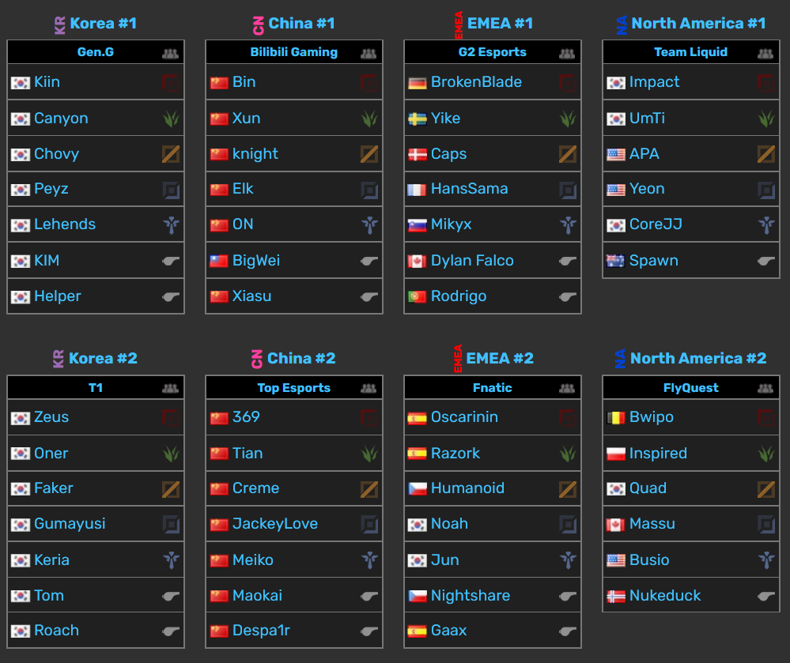
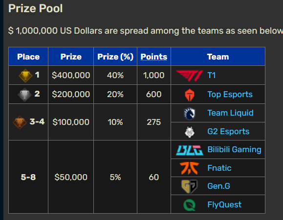
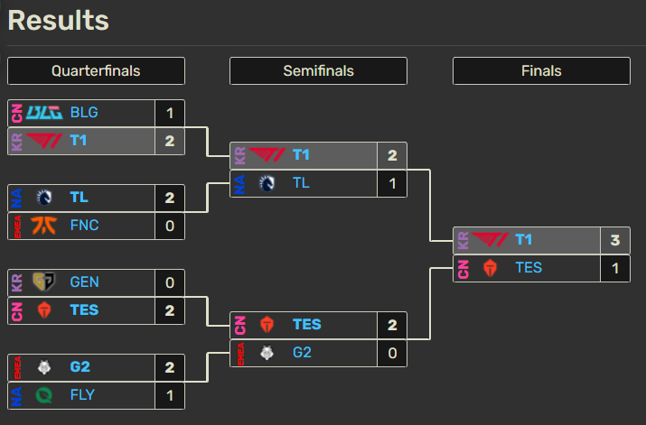

domain:: format
category:: format

- a [[format]] where a single loss result in the elimination of a [[participant]]
- the [[bracket]] for this format often takes the form of a balanced binary tree
- for case when an odd number of [[participant]]s is at play, usually multiple [[bye]]s is(are) applied
- scenarios
	- # Esports World Cup 2024
		- Reference: https://lol.fandom.com/wiki/Esports_World_Cup_2024
		- Game: League of Legends
		- Giải đấu có region: International
		- Giải đấu có 1 [[stage]] :
			- [[format]]: [[single elimination]]
				- các [[match]] không ảnh hưởng tới format vì chỉ có 1 stage
				- mỗi match có 2 [[team]]/[[participant]] tham gia, mỗi [[roster]] có 5 members
					- ở quarterfinals và semifinals [[mode]] là bo3, còn ở finals mode là bo5
						- -> mỗi match có 2-5 set, kết quả của từng [[set]] là thắng/thua, ảnh hưởng trực tiếp tới kết quả của match
					- match sẽ log lại thắng/thua, set sẽ log lại thắng/thua
					- kết quả của match là thắng/thua
					- mỗi participant là 1 đại diện quốc gia tham gia
						- rosters của participants được thể hiện như sau
							- 
							- từng member có 1 role và 1 region chính
				- kết quả của stage là [[standings]] để quyết định top 1, 2
					- 
				- bracket trông như sau
					- 
			- cả stage có 3 rounds:
				- quarterfinals
				- semifinals
				- finals
			- mode là closed (chỉ những team được mời mới được tham gia)
			- giới hạn cho participant:
				- tham gia theo team
				- chính xác 8 team
				- mỗi team cần có tối thiểu 5 members và chính xác 5 member trong 1 roster